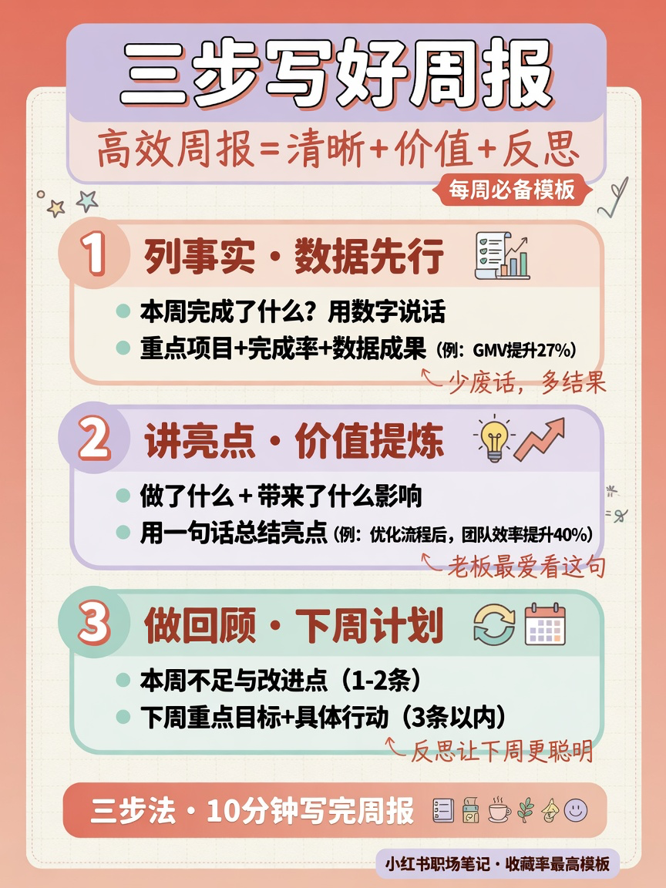

# tzai-image

[English](./README.md) | [简体中文](./README.zh-CN.md)

**Describe the outcome. The agent plans the creative work, confirms the direction, and renders the assets.**

Create single images or coordinated UI, social, publishing, brand, product, campaign, knowledge, deck, character, space, and narrative projects through **TaoziAPI** ([tzai.kdp.cool](https://tzai.kdp.cool)). Default model: **`gpt-image-2`**.

Works with Claude Code, Codex, Cursor, Grok Build, and [70+ agents](https://github.com/vercel-labs/skills#supported-agents) via [skills CLI](https://skills.sh/).

[](./LICENSE)
[](https://github.com/kedoupi/tzai-image-skill/actions/workflows/ci.yml)
[](https://github.com/kedoupi/tzai-image-skill)

---

## Ask for the outcome

```text
Design the onboarding and dashboard flow for my app.
Turn this article into a complete Xiaohongshu note with a cover and cards.
Rewrite this draft for WeChat and create its cover.
Read these chapters, propose useful illustration spots, then wait for approval.
Create a starter visual identity for this new brand.
Prepare a coordinated visual kit for this product launch.
```

The agent infers workflows, patterns, kinds, ratios, and references internally. A coordinated project follows two approval gates: approve the content/asset plan, then approve one generated visual anchor before the remaining paid batch.

| Internal layer | Count | Role |
| --- | --- | --- |
| **Creative workflows** | 27 | User outcomes, intake, approvals, deliverables, boundaries |
| **Visual patterns** | 22 | Reusable composition and prompt methods |
| **Image kinds** | 30 | Single-asset rendering primitives |
| **Engine** | 1 | Auth, dry-run, generation/edit requests, safe output writes |

Workflow catalog: [`docs/architecture/WORKFLOW-CATALOG.md`](./docs/architecture/WORKFLOW-CATALOG.md) · Pattern method: [`docs/architecture/PATTERN-LIBRARY.md`](./docs/architecture/PATTERN-LIBRARY.md) · Architecture: [`docs/architecture/CREATIVE-WORKFLOW-ARCHITECTURE.md`](./docs/architecture/CREATIVE-WORKFLOW-ARCHITECTURE.md) · Docs index: [`docs/README.md`](./docs/README.md).

## Agent workflow examples

| User says | The agent does | Deliverable |
| --- | --- | --- |
| “Design onboarding and a dashboard for this SaaS product.” | Infers users and key tasks, proposes a screen map, then generates one primary-screen anchor before the remaining screens | Screen map, UI copy, 1-8 coordinated UI images |
| “Turn this article into a complete Xiaohongshu note.” | Rewrites the content, proposes a card storyboard, confirms the plan, then confirms one cover before creating the cards | `note.md`, cover, ordered cards, asset map |
| “Rewrite this draft for WeChat and create the cover.” | Restructures the article, identifies useful visual positions, confirms the package, then produces the cover and approved section visuals | `article.md`, cover, optional illustrations, placement map |
| “Read every chapter and propose illustrations before generating.” | Uses the real headings, recommends only useful illustration spots, and waits for approval before any paid render | Illustration plan, images, captions, alt text |
| “Create a visual starter kit for this brand.” | Clarifies positioning and rights, proposes identity directions, then anchors the selected system | Moodboard, mark concepts, icon direction, touchpoint notes |
| “Prepare all visuals for this product launch.” | Builds a channel-aware asset plan and keeps claims outside generated pixels | Product hero, campaign derivatives, usage map, copy-safe areas |

### Example: article to Xiaohongshu note

```text
User
Turn this article into a Xiaohongshu note for product managers. Keep it
practical and professional. I want a cover and five content cards.

Agent — plan approval
I recommend a six-card package:
01 Cover: “AI Agent 落地指南”
02 Why chat alone is not an Agent
03 Goal → plan → tools → result
04 Three product-design decisions
05 Common failure modes
06 Save/share checklist and CTA

Visual system: editorial coral + navy, strong mobile hierarchy, short labels.
Paid scope: 6 images. I will generate only the cover after you approve this plan.

User
Approve the plan.

Agent — anchor approval
Generated assets/01-cover.png. Confirm this composition and visual system;
only then will I use it as --ref for cards 02-06.
```

The final package is reviewable and resumable:

```text
xhs-ai-agent-guide/
  brief.json
  plan.md
  note.md
  asset-plan.json
  deliverables.json
  assets/
    01-cover.png
    02-why-agent.png
    03-agent-loop.png
    04-product-decisions.png
    05-failure-modes.png
    06-checklist.png
```

<p align="center">
  
  
  
</p>

Single-image requests stay lightweight: a clear request can render directly. The plan and anchor gates apply to coordinated projects so the agent does not silently multiply paid calls.

<p align="center">
  
  
  
</p>

> **Demo bar:** gallery shots should read as design-agency finals / consulting decks / commercial photography — not toy clipart.  
> Prefer concrete subjects, materials, and lighting. Regenerate with `bash scripts/gen-demos.sh --force` (API key required).

---

## Install

```bash
npx skills add kedoupi/tzai-image-skill -g --all

# optional: link commands/*.md into Claude/Grok/Cursor command dirs
git clone https://github.com/kedoupi/tzai-image-skill.git && cd tzai-image-skill
bash scripts/install-slash-commands.sh
```

### API key

```bash
export TZAI_API_KEY='sk-xxxxxxxx'
# or durable:
bash ~/.agents/skills/tzai-image/scripts/tzai-image init --api-key sk-xxxxxxxx
bash ~/.agents/skills/tzai-image/scripts/tzai-image doctor
```

Key from [tzai.kdp.cool/console](https://tzai.kdp.cool/console). Never commit secrets.

### CLI quick start

```bash
E=~/.agents/skills/tzai-image/scripts/tzai-image
bash $E kinds
bash $E icon --prompt "spark for AI coding app" --image ./icon.png
bash $E xhs --prompt "三步写好周报" --image ./xhs.png
bash $E mindmap --prompt "产品战略拆解" --image ./mm.png   # long-tail
```

---

## Plan C slash map

### Engine

| Slash | Role |
| --- | --- |
| **`/tzai-image`** | Full engine: any kind, doctor, free-form generate |

### Category hubs (6)

| Slash | Domain | High-freq children | Long-tail via hub/engine |
| --- | --- | --- | --- |
| `/tzai-brand` | Brand | icon, logo | moodboard, mascot, badge, avatar |
| `/tzai-diagram` | Structure | flowchart, architecture, infographic | mindmap, diagram, dataviz |
| `/tzai-product` | Product UX | ui | wireframe, empty-state, onboarding |
| `/tzai-marketing` | Marketing | cover, slide | banner, email-header, poster |
| `/tzai-social` | Social | xhs, xhs-cover, wechat | — |
| `/tzai-photo` | Photo / art | — | product-photo, photo, landscape, illustration, storybook, food |

### High-frequency kinds (11)

| Slash | Kind | AR | Highlights |
| --- | --- | --- | --- |
| `/tzai-icon` | icon | 1:1 | App icon, single metaphor, no text |
| `/tzai-logo` | logo | 16:9 | Mark / monogram concept |
| `/tzai-flowchart` | flowchart | 16:9 | Process steps, consulting clarity |
| `/tzai-architecture` | architecture | 16:9 | System layers / isometric |
| `/tzai-infographic` | infographic | 16:9 | Metrics / knowledge layout |
| `/tzai-cover` | cover | 16:9 | Article cover + title space |
| `/tzai-slide` | slide | 16:9 | Deck title background |
| `/tzai-xhs` | xhs | 3:4 | Xiaohongshu knowledge card |
| `/tzai-xhs-cover` | xhs-cover | 3:4 | Feed cover / stop-scroll |
| `/tzai-wechat` | wechat | 16:9 | WeChat article visual |
| `/tzai-ui` | ui | 16:9 | SaaS dashboard mock |

---

# Gallery — learn by example

Each block: **when to use** → **what this layer highlights** → **slash + CLI** → **result image**.  
Put only the **subject** in the prompt; kind injects art direction.

Regenerate all demo files (needs API key):

```bash
bash scripts/gen-demos.sh          # skip existing
bash scripts/gen-demos.sh --force  # overwrite
bash scripts/gen-demos.sh --only xhs cover wechat
```

---

## A. Engine — `/tzai-image`

**When:** free-form job, long-tail kind, or “just draw something”.  
**Highlights:** one CLI for every kind; `kinds` / `doctor` / model defaults.

```text
/tzai-image icon 火花隐喻，AI 编程 App
/tzai-image mindmap 产品战略拆解
```

```bash
bash ~/.agents/skills/tzai-image/scripts/tzai-image icon \
  --prompt "火花隐喻，AI 编程 App 图标" --image ./icon-app.png
```


---

## B. Category hubs

### `/tzai-brand` — 品牌识别

**When:** “做点品牌相关图”，还不确定 icon 还是 logo。  
**Highlights:** routes to brand kit kinds; high-freq **icon/logo** have direct slashes.

```text
/tzai-brand icon 火花与代码感 App 图标
```

```bash
bash ~/.agents/skills/tzai-image/scripts/tzai-image icon \
  --prompt "品牌识别：火花与代码感 App 图标概念" --image ./icon-app.png
```


Long-tail in this hub: `moodboard` `mascot` `badge` `avatar` → `/tzai-image mascot …`

---

### `/tzai-diagram` — 结构图示

**When:** “画个结构/流程/信息图”，先选类型。  
**Highlights:** work diagrams + infographic family.

```text
/tzai-diagram architecture 客户端 网关 微服务 DB 队列
```

```bash
bash ~/.agents/skills/tzai-image/scripts/tzai-image architecture \
  --prompt "客户端 / 网关 / 微服务 / DB / 队列，等距技术风" --image ./arch.png
```


---

### `/tzai-product` — 产品设计

**When:** 产品演示、空状态、线框（非商品摄影）。  
**Highlights:** UX visuals; direct slash **`/tzai-ui`**.

```text
/tzai-product ui SaaS 数据分析仪表盘
```

```bash
bash ~/.agents/skills/tzai-image/scripts/tzai-image ui \
  --prompt "SaaS 数据分析仪表盘，卡片 KPI 图表，浅色模式" --image ./ui.png
```


> **Note:** catalog photography is kind **`product-photo`** (alias `product`), not this hub. Use `/tzai-image product-photo` or hub `/tzai-photo`.

---

### `/tzai-marketing` — 市场内容

**When:** 封面、PPT、投放物料。  
**Highlights:** direct **`/tzai-cover`** **`/tzai-slide`**.

```text
/tzai-marketing slide 咨询风分享会开场底图
```

```bash
bash ~/.agents/skills/tzai-image/scripts/tzai-image slide \
  --prompt "分享会开场页底图，咨询几何，中部留标题区" --image ./slide.png
```


---

### `/tzai-social` — 社交种草

**When:** 小红书 / 微信内容图。  
**Highlights:** all three social kinds are high-freq slashes.

```text
/tzai-social xhs 三步写好周报
```

```bash
bash ~/.agents/skills/tzai-image/scripts/tzai-image xhs \
  --prompt "三步写好周报：列清单 写重点 加复盘" --image ./xhs.png
```


---

### `/tzai-photo` — 影像插画

**When:** 商品、风光、美食、绘本等 **long-tail** 影像。  
**Highlights:** no high-freq kind slashes here — always hub or engine.

```text
/tzai-photo product-photo 哑光几何产品棚拍
/tzai-image food 拉花拿铁浅景深
```

```bash
bash ~/.agents/skills/tzai-image/scripts/tzai-image product-photo \
  --prompt "哑光几何体商品，柔光棚拍，目录级质感" --image ./product.png
```


---

## C. High-frequency kind commands

### `/tzai-icon` · App icon

**Highlights:** rounded square, flat vector, **one** metaphor, **no text**.

```text
/tzai-icon 发光火花，AI 编程 App
```

```bash
bash ~/.agents/skills/tzai-image/scripts/tzai-image icon \
  --prompt "圆角方 App 图标，发光火花隐喻，扁平矢量，无文字" --image ./icon-app.png
```


---

### `/tzai-logo` · Logo / monogram

**Highlights:** geometric mark, negative space; treat as **concept**, not final SVG.

```text
/tzai-logo 几何 N，靛蓝与电青绿
```

```bash
bash ~/.agents/skills/tzai-image/scripts/tzai-image logo \
  --prompt "几何 N monogram，靛蓝与电青绿，充足负空间" --image ./logo.png
```


---

### `/tzai-flowchart` · Process

**Highlights:** left-to-right steps, clean arrows, white/corporate palette.

```text
/tzai-flowchart 注册 → 激活 → 付费
```

```bash
bash ~/.agents/skills/tzai-image/scripts/tzai-image flowchart \
  --prompt "注册 → 激活 → 付费，五步从左到右带箭头" --image ./flow.png
```


---

### `/tzai-architecture` · System architecture

**Highlights:** clients / gateway / services / DB / queue; isometric or layered.

```text
/tzai-architecture 客户端 网关 微服务 DB 队列
```

```bash
bash ~/.agents/skills/tzai-image/scripts/tzai-image architecture \
  --prompt "客户端 / 网关 / 微服务 / DB / 队列，等距技术风" --image ./arch.png
```


---

### `/tzai-infographic` · Infographic

**Highlights:** hierarchy, metric cards, publication-ready layout.

```text
/tzai-infographic Q1 增长四要素：获客 激活 留存 变现
```

```bash
bash ~/.agents/skills/tzai-image/scripts/tzai-image infographic \
  --prompt "Q1 增长四要素：获客 激活 留存 变现，四卡片指标墙" --image ./info.png
```


---

### `/tzai-cover` · Article cover

**Highlights:** mood + **title safe area** (prefer overlay text; avoid long baked-in titles).

```text
/tzai-cover 技术博客封面，深色代码光轨，标题留白
```

```bash
bash ~/.agents/skills/tzai-image/scripts/tzai-image cover \
  --prompt "技术博客封面：深色渐变与抽象代码光轨，大面积标题留白" --image ./cover.png
```


---

### `/tzai-slide` · Deck title visual

**Highlights:** consulting geometry, room for title, little body text.

```text
/tzai-slide 分享会开场底图
```

```bash
bash ~/.agents/skills/tzai-image/scripts/tzai-image slide \
  --prompt "分享会开场页底图，咨询几何，中部留标题区" --image ./slide.png
```


---

### `/tzai-xhs` · Xiaohongshu card

**Highlights:** 3:4 knowledge card, bold hierarchy, social-feed friendly.

```text
/tzai-xhs 三步写好周报
```

```bash
bash ~/.agents/skills/tzai-image/scripts/tzai-image xhs \
  --prompt "三步写好周报：列清单 写重点 加复盘，高对比知识卡" --image ./xhs.png
```


---

### `/tzai-xhs-cover` · XHS cover

**Highlights:** **feed cover layout** (big title + subtitle band) — not an e-commerce product shot.

```text
/tzai-xhs-cover 周报模板 职场干货封面
```

```bash
bash ~/.agents/skills/tzai-image/scripts/tzai-image xhs-cover \
  --style bold --layout sparse \
  --prompt "Feed cover (not product photo): big title 周报模板 + subtitle 职场干货, magazine cover blocks" \
  --image ./xhs-cover.png
```


---

### `/tzai-wechat` · WeChat visual

**Highlights:** Official Account header / inline art, soft professional palette.

```text
/tzai-wechat 远程协作与灵感火花
```

```bash
bash ~/.agents/skills/tzai-image/scripts/tzai-image wechat \
  --prompt "公众号配图：远程协作与灵感火花，柔和专业" --image ./wechat.png
```


---

### `/tzai-ui` · UI dashboard mock

**Highlights:** SaaS cards/KPIs/charts; no real PII.

```text
/tzai-ui 数据分析仪表盘浅色模式
```

```bash
bash ~/.agents/skills/tzai-image/scripts/tzai-image ui \
  --prompt "SaaS 数据分析仪表盘，卡片 KPI 图表，浅色模式" --image ./ui.png
```


---

## D. Long-tail examples (engine only)

No `/tzai-mindmap` slash — use engine or category.

| Need | Command |
| --- | --- |
| Mind map | `/tzai-image mindmap …` or hub `/tzai-diagram` |
| Wireframe | `/tzai-image wireframe …` |
| Mascot | `/tzai-image mascot …` |
| Food photo | `/tzai-image food …` |
| Banner | `/tzai-image banner …` |

```bash
bash ~/.agents/skills/tzai-image/scripts/tzai-image mindmap \
  --prompt "策略拆解中心节点，六条分支" --image ./mindmap.png
```


```bash
bash ~/.agents/skills/tzai-image/scripts/tzai-image wireframe \
  --prompt "移动端低保真线框多屏" --image ./wire.png
```


```bash
bash ~/.agents/skills/tzai-image/scripts/tzai-image food \
  --prompt "拉花拿铁，木桌，晨光浅景深" --image ./food.png
```


More long-tail samples (same engine):

| Kind | Sample |
| --- | --- |
| moodboard |  |
| empty-state |  |
| onboarding |  |
| banner |  |
| poster |  |
| mascot |  |
| landscape |  |

```bash
bash ~/.agents/skills/tzai-image/scripts/tzai-image kinds   # full catalog
```

---

## Prompt tips for single assets

| Job | Put in `--prompt` | Kind already handles |
| --- | --- | --- |
| Icon | metaphor + product domain | rounded square, flat, no text |
| Flow | step names A → B → C | arrows, corporate clarity |
| XHS | title + bullet points | 3:4 social card look |
| Cover | topic + mood | title space, editorial light |
| Arch | components list | isometric / layers |

For a single asset, keep the brief concise because the kind supplies baseline art direction. For projects, the agent composes a structured brief from the selected workflow and pattern.

---

## Multi-image workflows (agents)

| Job | Playbook |
| --- | --- |
| Full workflow router | `skills/tzai-image/references/workflows/index.tsv` |
| Complete XHS note | `…/workflows/xhs-note.md` |
| WeChat article package | `…/workflows/wechat-article.md` |
| Article illustration plan | `…/workflows/article-illustrate.md` |
| Single/multi-screen UI | `…/workflows/ui-flow.md` |
| Deck visual package | `…/workflows/deck-package.md` |

Validate a saved plan offline:

```bash
python3 skills/tzai-image/scripts/validate-workflow-plan --for-anchor asset-plan.json
python3 skills/tzai-image/scripts/validate-workflow-plan --for-batch asset-plan.json
```

Style anchor with reference image (`/v1/images/edits`):

```bash
bash $E cover --prompt "series cover…" --image 01.png
bash $E illustration --ref ./01.png --prompt "section 2, same visual system" --image 02.png
```

## Scene matrices (style × layout × cover dimensions)

```bash
bash ~/.agents/skills/tzai-image/scripts/tzai-image presets xhs
bash ~/.agents/skills/tzai-image/scripts/tzai-image presets infographic
bash ~/.agents/skills/tzai-image/scripts/tzai-image presets cover
```

### Xiaohongshu — style × layout × palette

```bash
bash $E xhs --preset knowledge-card --prompt "三步写好周报" --image xhs.png
bash $E xhs --style notion --layout dense --prompt "三步写好周报" --image xhs.png
```

| Flag | Examples |
| --- | --- |
| `--style` | cute, notion, bold, study-notes, chalkboard, … |
| `--layout` | sparse, balanced, dense, list, comparison, flow |
| `--palette` | macaron, warm, neon |
| `--preset` | knowledge-card, checklist, tutorial, cover-stop, … |

Series workflow: `skills/tzai-image/references/workflows/xhs-series.md`.

### Infographic — layout × style

```bash
bash $E infographic --layout funnel --style tech-schematic --prompt "signup funnel" --image f.png
bash $E infographic --layout metrics --style clean-corporate --prompt "Q1 KPIs" --image k.png
```

### Cover — 5 dimensions

```bash
bash $E cover --type hero --palette dark --mood bold --text none \
  --prompt "distributed observability" --image cover.png
```

| Dim | Flag | Values |
| --- | --- | --- |
| Type | `--type` | hero, conceptual, minimal, scene, … |
| Palette | `--palette` | cool, dark, warm, pastel, … |
| Rendering | `--rendering` | digital, flat-vector, painterly, … |
| Text | `--text` | **none**, title-only, title-subtitle |
| Mood | `--mood` | subtle, balanced, bold |

Prefer `--text none` / title-safe empty areas over long baked-in titles.

---

## Configuration

| Variable | Meaning | Default |
| --- | --- | --- |
| `TZAI_API_KEY` | API key | required for real calls |
| `TZAI_BASE_URL` | Gateway | `https://tzai.kdp.cool` |
| `TZAI_IMAGE_MODEL` | Image model | **`gpt-image-2`** |
| `TZAI_DEFAULT_AR` | Aspect | `1:1` |
| `TZAI_TIMEOUT_SEC` | Timeout | `120` |

**Load order (later wins):** `.skill-data` → process env → `$TZAI_IMAGE_CONFIG` → CLI.

| `--ar` | Best for |
| --- | --- |
| `1:1` | icons, product, stickers |
| `16:9` | diagrams, decks, UI, banners |
| `9:16` | mobile wireframe, posters |
| `3:4` | Xiaohongshu |

## CLI

```text
kinds [id]
init / doctor / which-config / models
generate --kind <id> --prompt ... --image out.png [--ar] [--dry-run]
<kind> --prompt ... --image out.png
```

## Maintainers

```bash
bash scripts/gen-kind-skills.sh      # rebuild Plan C thin skills + commands/
bash scripts/install-slash-commands.sh
bash scripts/gen-demos.sh            # README screenshots
bash tests/run.sh                    # offline
```

## Agent guidance

1. `doctor` if auth may be missing  
2. High-freq intent → direct slash; broad → hub; else engine + `kinds`  
3. Subject-only `--prompt`  
4. Default `gpt-image-2`  
5. Return file path  

---

Built for coding agents: **one TaoziAPI engine**, scenario kinds, and a focused slash surface.
