# tzai-image

[English](./README.md) | [简体中文](./README.zh-CN.md)

**One skill. One API. Cover every image job your team hits at work.**

Generate production-ready visuals from coding agents via **TaoziAPI** ([tzai.kdp.cool](https://tzai.kdp.cool)), powered by **`gpt-image-2`** by default.

Works with Claude Code, Codex, Cursor, Grok Build, and [70+ agents](https://github.com/vercel-labs/skills#supported-agents) via the [skills CLI](https://skills.sh/).

[](./LICENSE)
[](https://github.com/kedoupi/tzai-image-skill)

<p align="center">
  
  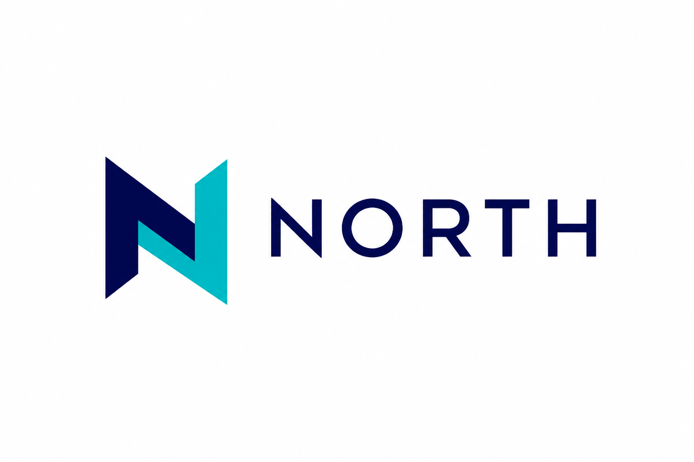
  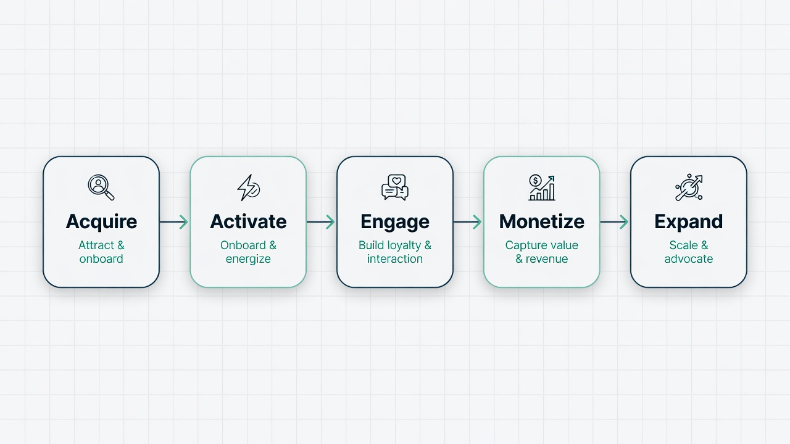
</p>

<p align="center">
  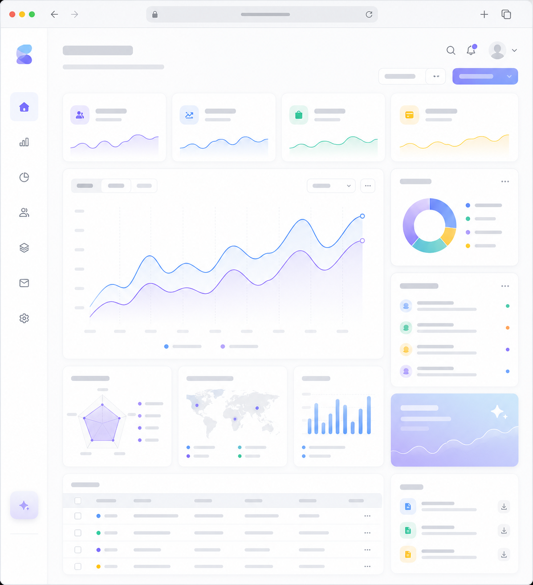
  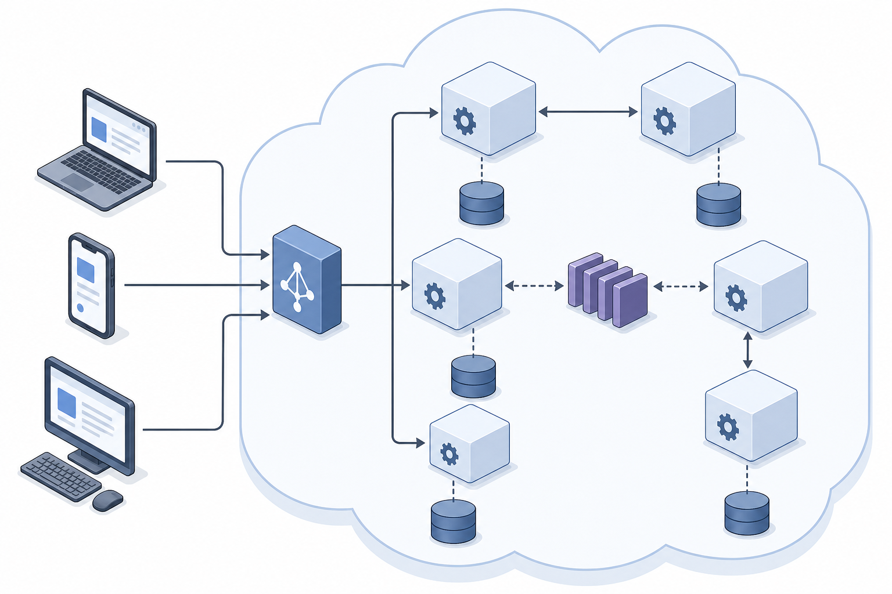
</p>

## Product modules (分类 × 功能)

Inspired by baoyu’s scene skills (`baoyu-xhs-images`, `baoyu-infographic`, `baoyu-diagram`, …),
we ship **one engine** with **built-in scenario kinds** — not twenty separate installs.

```bash
tzai-image kinds                 # list all modules
tzai-image kinds xhs             # detail one kind
tzai-image icon --prompt "..." --image out.png
tzai-image flowchart --prompt "..." --image out.png
tzai-image generate --kind infographic --prompt "..." --image out.png
```

| Module | Kinds (functions) | Covers baoyu-like scenes |
| --- | --- | --- |
| **brand** | `icon` `logo` `moodboard` `mascot` `badge` `avatar` | Brand kit assets |
| **diagram** | `flowchart` `architecture` `mindmap` `diagram` `infographic` `dataviz` | ≈ diagram + infographic |
| **product** | `ui` `wireframe` `empty-state` `onboarding` | Product design visuals |
| **marketing** | `slide` `banner` `email-header` `cover` `poster` | ≈ cover + deck creatives |
| **social** | `xhs` `xhs-cover` `wechat` | ≈ **小红书 / 微信** image cards |
| **photo** | `product` `photo` `landscape` `illustration` `storybook` `food` | Photo & illustration |

Each kind sets a **default aspect ratio** and injects **professional art direction**; you only pass the subject in `--prompt`.

## Why this skill is enough

Most teams juggle **icons, logos, decks, diagrams, UI mocks, ads, empty states, avatars**… and bounce between random web UIs.

`tzai-image` collapses that into one agent-native CLI with **kind modules**:

| Pain today | With tzai-image |
| --- | --- |
| Switch 5 tools for 5 image types | **One command**, change only the prompt + aspect ratio |
| Inconsistent model quality | Default **`gpt-image-2`** (best on TaoziAPI) |
| Keys stuck in chat history | **Env or durable config**; never in the package |
| Hard to reproduce | Same CLI in CI / hooks / any agent |

**All screenshots in this README were generated by this skill** (live `gpt-image-2` via TaoziAPI).

### Direction map (24 real cases)

| # | Direction | Aspect | Sample |
| --- | --- | --- | --- |
| 1 | App **icon** | 1:1 | [icon-app](#1-app-icon-design) |
| 2 | **Logo** / monogram | 16:9 | [logo-wordmark](#2-logo--brand-mark) |
| 3 | Brand **mood board** | 16:9 | [brand-moodboard](#3-brand-mood-board) |
| 4 | **Flowchart** / process | 16:9 | [flowchart-process](#4-flowchart--process) |
| 5 | **Architecture** diagram | 16:9 | [architecture-isometric](#5-system-architecture) |
| 6 | **Mind map** | 1:1 | [mindmap-strategy](#6-mind-map) |
| 7 | Workflow **infographic** | 16:9 | [diagram-flow](#7-workflow-infographic) |
| 8 | Stats **infographic** | 16:9 | [infographic-stats](#8-stats-infographic) |
| 9 | **UI dashboard** mock | 16:9 | [ui-dashboard](#9-ui-dashboard-mock) |
| 10 | Mobile **wireframe** | 9:16 | [wireframe-mobile](#10-mobile-wireframe) |
| 11 | **Empty state** | 1:1 | [empty-state](#11-empty-state-illustration) |
| 12 | **Onboarding** hero | 16:9 | [onboarding-hero](#12-onboarding-hero) |
| 13 | **Slide** title visual | 16:9 | [slide-cover](#13-presentation-slide-cover) |
| 14 | Campaign **banner** | 16:9 | [banner-campaign](#14-campaign-banner) |
| 15 | **Email** header | 16:9 | [email-header](#15-email-newsletter-header) |
| 16 | Achievement **badges** | 1:1 | [badge-sticker](#16-badge--sticker-set) |
| 17 | Team **avatar** | 1:1 | [avatar-professional](#17-professional-avatar) |
| 18 | 3D **mascot** | 1:1 | [3d-mascot](#18-3d-brand-mascot) |
| 19 | **Data viz** art | 16:9 | [data-viz-art](#19-data-visualization-art) |
| 20 | Product **catalog** | 1:1 | [product-cube](#20-product--catalog-photo) |
| 21 | Tech **poster** | 9:16 | [poster-tech](#21-vertical-tech-poster) |
| 22 | **Landscape** / hero | 16:9 | [landscape-dawn](#22-cinematic-landscape) |
| 23 | Storybook **illustration** | 1:1 | [illustration-story](#23-storybook-illustration) |
| 24 | Food / **lifestyle** | 1:1 | [food-macro](#24-food--lifestyle) |

---

## Gallery — brand & identity

### 1. App icon design


```bash
bash ~/.agents/skills/tzai-image/scripts/tzai-image generate \
  --ar 1:1 --image ./icon-app.png \
  --prompt "Minimal mobile app icon, rounded square, flat vector, glowing spark metaphor, soft blue gradient, iOS style, no text"
```

### 2. Logo / brand mark


```bash
bash ~/.agents/skills/tzai-image/scripts/tzai-image generate \
  --ar 16:9 --image ./logo.png \
  --prompt "Modern tech logo monogram with geometric N chevrons, indigo and electric teal, flat vector, white background, ample negative space"
```

### 3. Brand mood board

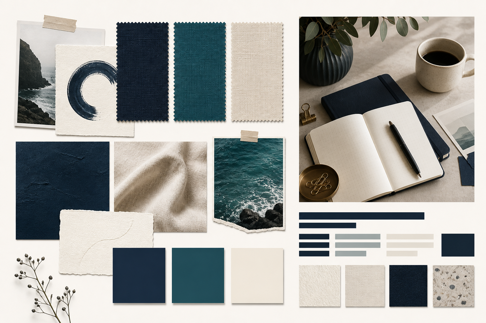

```bash
bash ~/.agents/skills/tzai-image/scripts/tzai-image generate \
  --ar 16:9 --image ./moodboard.png \
  --prompt "Brand mood board: fabric textures, indigo teal cream color chips, abstract type bars, lifestyle desk photo, design agency style"
```

---

## Gallery — diagrams & structure (work)

### 4. Flowchart / process


```bash
bash ~/.agents/skills/tzai-image/scripts/tzai-image generate \
  --ar 16:9 --image ./flowchart.png \
  --prompt "Professional flowchart, 5 steps left to right with icons and clean arrows, soft blue corporate palette, white background, consulting slide style"
```

### 5. System architecture


```bash
bash ~/.agents/skills/tzai-image/scripts/tzai-image generate \
  --ar 16:9 --image ./architecture.png \
  --prompt "Isometric software architecture: clients, API gateway, microservices, databases, message queue, cloud region, muted blues, technical illustration"
```

### 6. Mind map

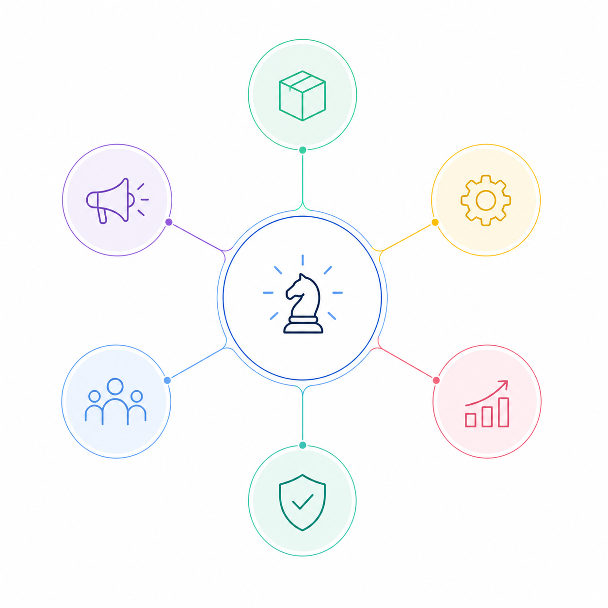

```bash
bash ~/.agents/skills/tzai-image/scripts/tzai-image generate \
  --ar 1:1 --image ./mindmap.png \
  --prompt "Clean strategy mind map, center node with 6 pastel branches, thin connectors, white background, business workshop style"
```

### 7. Workflow infographic

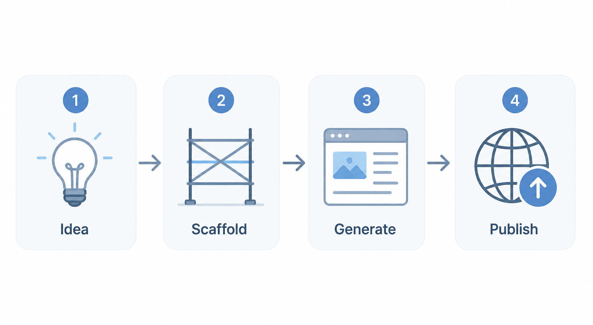

```bash
bash ~/.agents/skills/tzai-image/scripts/tzai-image generate \
  --ar 16:9 --image ./workflow.png \
  --prompt "Flat infographic: Idea → Scaffold → Generate → Publish, rounded cards, muted blue-gray, white background"
```

### 8. Stats infographic

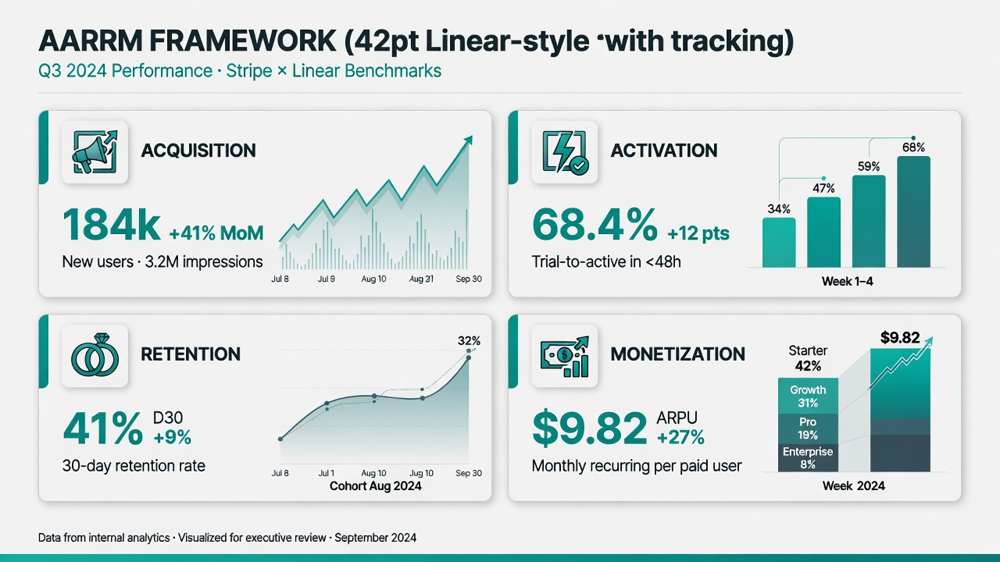

```bash
bash ~/.agents/skills/tzai-image/scripts/tzai-image generate \
  --ar 16:9 --image ./stats.png \
  --prompt "Business infographic with four metric cards and growth bars, teal and slate, clean corporate, white background"
```

---

## Gallery — product design

### 9. UI dashboard mock


```bash
bash ~/.agents/skills/tzai-image/scripts/tzai-image generate \
  --ar 16:9 --image ./dashboard.png \
  --prompt "SaaS analytics dashboard UI mock, light mode, glass cards, charts and KPI tiles, modern product design, no real readable labels"
```

### 10. Mobile wireframe

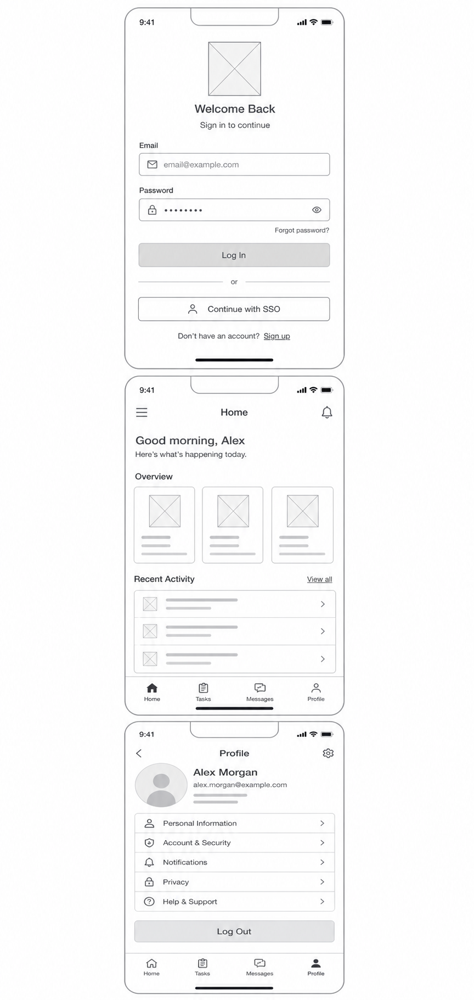

```bash
bash ~/.agents/skills/tzai-image/scripts/tzai-image generate \
  --ar 9:16 --image ./wireframe.png \
  --prompt "Low-fidelity mobile wireframes stacked: login home profile, gray boxes and lines, UX documentation style, white background"
```

### 11. Empty-state illustration

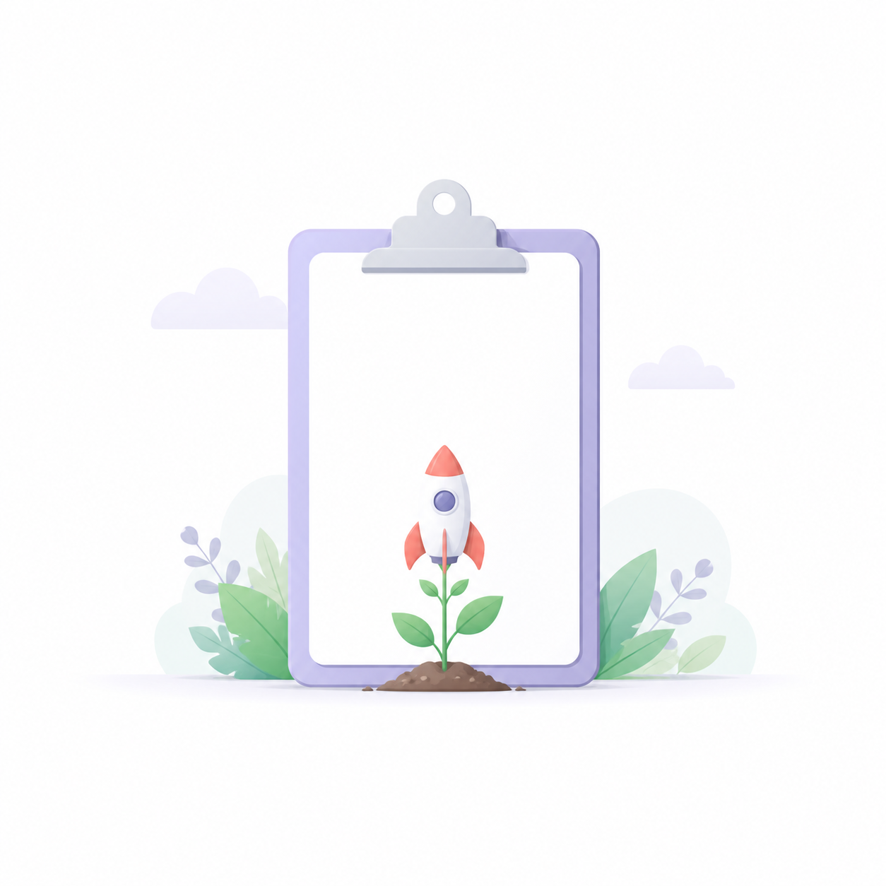

```bash
bash ~/.agents/skills/tzai-image/scripts/tzai-image generate \
  --ar 1:1 --image ./empty-state.png \
  --prompt "Friendly empty-state for project app: empty clipboard with tiny rocket plant, soft flat pastel illustration, space for UI copy"
```

### 12. Onboarding hero


```bash
bash ~/.agents/skills/tzai-image/scripts/tzai-image generate \
  --ar 16:9 --image ./onboarding.png \
  --prompt "Product onboarding hero: team collaborating around floating UI cards, modern SaaS flat illustration, bright professional, no logos"
```

---

## Gallery — marketing & content ops

### 13. Presentation slide cover


```bash
bash ~/.agents/skills/tzai-image/scripts/tzai-image generate \
  --ar 16:9 --image ./slide.png \
  --prompt "Presentation title slide background, abstract geometry, deep navy and gold, consulting deck aesthetic, space for title, no text"
```

### 14. Campaign banner


```bash
bash ~/.agents/skills/tzai-image/scripts/tzai-image generate \
  --ar 16:9 --image ./banner.png \
  --prompt "B2B AI tools launch ad banner, bold diagonal split, dark and cyan, abstract AI nodes, high contrast, no brand text"
```

### 15. Email newsletter header


```bash
bash ~/.agents/skills/tzai-image/scripts/tzai-image generate \
  --ar 16:9 --image ./email-header.png \
  --prompt "Developer tools newsletter header, abstract code brackets morphing into a path, indigo purple gradient, no text"
```

### 16. Badge / sticker set


```bash
bash ~/.agents/skills/tzai-image/scripts/tzai-image generate \
  --ar 1:1 --image ./badges.png \
  --prompt "2x2 circular achievement badges: star rocket shield check, flat sticker style, white background, gamification UI"
```

### 17. Professional avatar


```bash
bash ~/.agents/skills/tzai-image/scripts/tzai-image generate \
  --ar 1:1 --image ./avatar.png \
  --prompt "Professional avatar illustration, friendly product manager, soft studio light, solid light gray background, team directory style"
```

### 18. 3D brand mascot


```bash
bash ~/.agents/skills/tzai-image/scripts/tzai-image generate \
  --ar 1:1 --image ./mascot.png \
  --prompt "Cute 3D clay fox mascot with headset, soft studio light, pastel background, simple product mascot"
```

### 19. Data visualization art

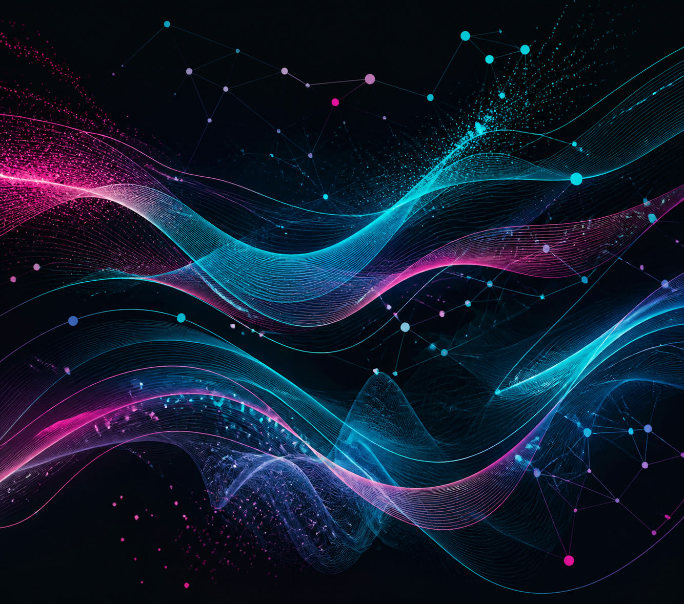

```bash
bash ~/.agents/skills/tzai-image/scripts/tzai-image generate \
  --ar 16:9 --image ./dataviz.png \
  --prompt "Abstract data visualization art, flowing ribbon charts and constellation dots, dark background, cyan magenta accents"
```

---

## Gallery — photo, poster & lifestyle

### 20. Product / catalog photo

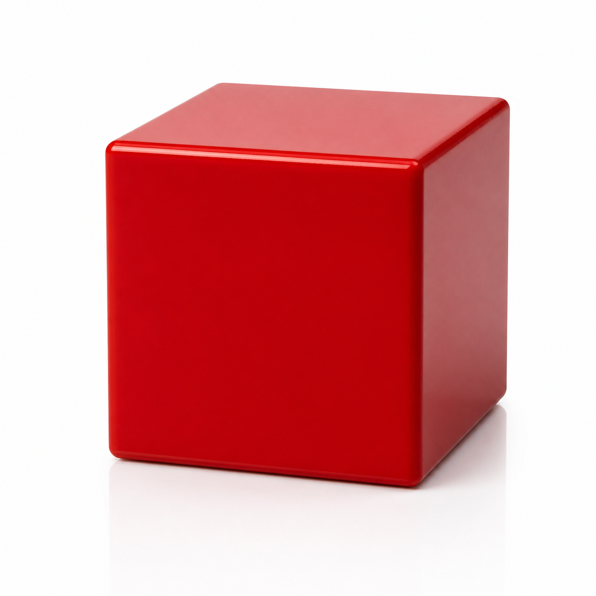

```bash
bash ~/.agents/skills/tzai-image/scripts/tzai-image generate \
  --ar 1:1 --image ./product.png \
  --prompt "Product photo of a glossy red cube on pure white background, soft studio light, commercial catalog style"
```

### 21. Vertical tech poster


```bash
bash ~/.agents/skills/tzai-image/scripts/tzai-image generate \
  --ar 9:16 --image ./poster.png \
  --prompt "Vertical tech poster for an AI coding agent, dark navy, neon cyan, abstract neural circuits, minimal UI aesthetic"
```

### 22. Cinematic landscape


```bash
bash ~/.agents/skills/tzai-image/scripts/tzai-image generate \
  --ar 16:9 --image ./landscape.png \
  --prompt "Cinematic golden-hour mountain lake, mist, pine silhouette, National Geographic style"
```

### 23. Storybook illustration

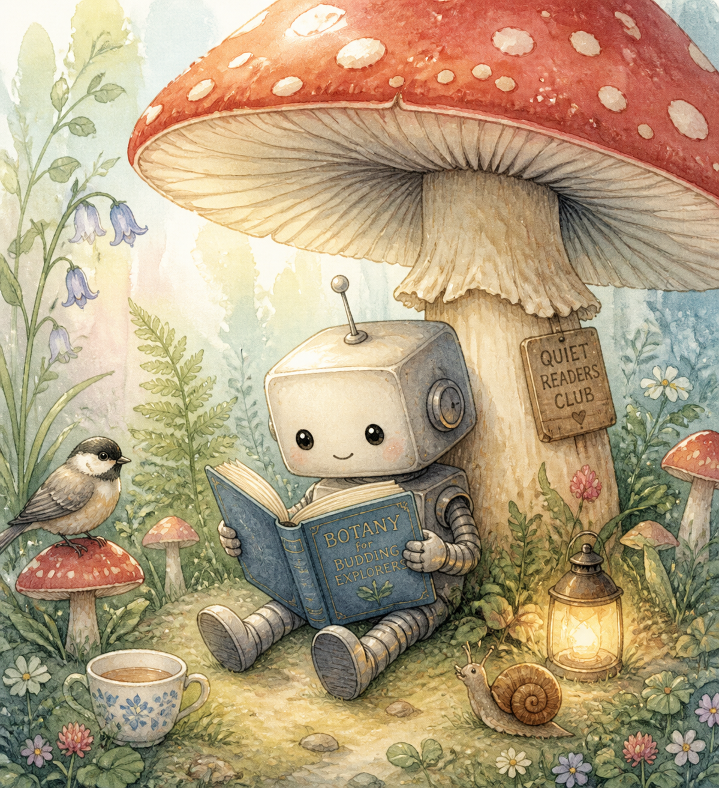

```bash
bash ~/.agents/skills/tzai-image/scripts/tzai-image generate \
  --ar 1:1 --image ./story.png \
  --prompt "Storybook illustration: small robot reading under a giant mushroom, soft watercolor, pastel, children's book style"
```

### 24. Food / lifestyle


```bash
bash ~/.agents/skills/tzai-image/scripts/tzai-image generate \
  --ar 1:1 --image ./food.png \
  --prompt "Macro latte with heart art, wooden table, morning window light, shallow depth of field"
```

---

## Prompt cheat sheet (work)

| Job | `--ar` | Say in the prompt |
| --- | --- | --- |
| Icon | `1:1` | rounded square, flat vector, single metaphor, no text |
| Logo | `1:1` / `16:9` | monogram, brand colors, negative space, vector |
| Flow / org chart | `16:9` | left-to-right steps, clean arrows, corporate palette |
| Architecture | `16:9` | isometric, gateway, services, DB, queue |
| UI mock | `16:9` | light/dark mode, cards, charts, no real private data |
| Wireframe | `9:16` | gray boxes, low-fi, documentation style |
| Slide / banner | `16:9` | leave title space, high contrast, no fake body text |
| Empty / onboarding | `1:1` / `16:9` | friendly flat art, whitespace for copy |

Always state **style + lighting + background + what to avoid** (watermark, garbled fake text).

---

## Install

```bash
npx skills add kedoupi/tzai-image-skill -g --all
```

## Get an API key

This skill does **not** ship with a key.

1. Open [https://tzai.kdp.cool/console](https://tzai.kdp.cool/console)
2. Create an API token
3. Configure (pick one):

```bash
# A) Global env
export TZAI_API_KEY='sk-xxxxxxxx'

# B) Durable file (survives npx skills update)
bash ~/.agents/skills/tzai-image/scripts/tzai-image init --api-key sk-xxxxxxxx

# C) One-shot flag
bash ~/.agents/skills/tzai-image/scripts/tzai-image generate \
  --api-key sk-xxxxxxxx --prompt "a cat" --image cat.png
```

Never commit keys. Do not store them only inside the skill package directory.

## Quick start

```bash
bash ~/.agents/skills/tzai-image/scripts/tzai-image doctor
bash ~/.agents/skills/tzai-image/scripts/tzai-image kinds

bash ~/.agents/skills/tzai-image/scripts/tzai-image icon \
  --prompt "spark for AI coding app" --image ./icon.png
bash ~/.agents/skills/tzai-image/scripts/tzai-image flowchart \
  --prompt "signup → activate → pay" --image ./flow.png
bash ~/.agents/skills/tzai-image/scripts/tzai-image xhs \
  --prompt "三步写好周报" --image ./xhs.png
bash ~/.agents/skills/tzai-image/scripts/tzai-image infographic \
  --prompt "Q1 growth four pillars" --image ./info.png
```

Default model **`gpt-image-2`**. Scene quality comes from **`--kind` / kind subcommands**.

## Configuration

| Variable | Meaning | Default |
| --- | --- | --- |
| `TZAI_API_KEY` | API key | required for real calls |
| `TZAI_BASE_URL` | Gateway | `https://tzai.kdp.cool` |
| `TZAI_IMAGE_MODEL` | Image model | **`gpt-image-2`** |
| `TZAI_DEFAULT_AR` | Aspect | `1:1` |
| `TZAI_TIMEOUT_SEC` | Timeout | `120` |
| `TZAI_IMAGE_CONFIG` | Explicit env file | unset |

**Load order (later wins):** `.skill-data` files → **process env** → `$TZAI_IMAGE_CONFIG` → CLI.

| `--ar` | Best for |
| --- | --- |
| `1:1` | icons, avatars, product, stickers |
| `16:9` | diagrams, decks, dashboards, banners |
| `9:16` | mobile UI, stories, vertical posters |
| `4:3` / `3:4` | classic photo / portrait |

## CLI

```text
kinds [id]
init --api-key sk-... [...]
doctor [--strict-auth]
which-config | config-path
models
generate --kind <id> --prompt ... --image out.png [--ar] [--model] [--dry-run] [--json]
<kind> --prompt ... --image out.png    # icon|logo|flowchart|xhs|infographic|...
--version
```

Kinds catalog: `skills/tzai-image/references/kinds.tsv`.

## Agent guidance

When the user needs any image:

1. `doctor` if key might be missing  
2. **Map intent → kind** (`xhs` / `flowchart` / `icon` / `infographic` / …) via `kinds`  
3. Put only the **subject** in `--prompt` (kind supplies art direction + default AR)  
4. Generate with default `gpt-image-2`  
5. Return the file path  

Use host-native tools only for throwaway doodles; use **tzai-image** for TaoziAPI quality and reproducibility.

## Development

```bash
git clone https://github.com/kedoupi/tzai-image-skill.git
cd tzai-image-skill
bash tests/run.sh
```

## License

[MIT](./LICENSE)

## Links

- GitHub: https://github.com/kedoupi/tzai-image-skill  
- TaoziAPI: https://tzai.kdp.cool  
- Incubator: https://github.com/kedoupi/skills  
